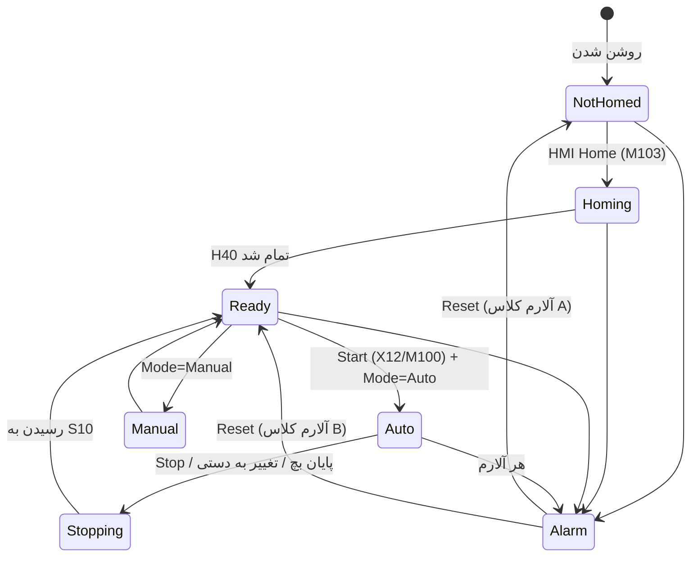
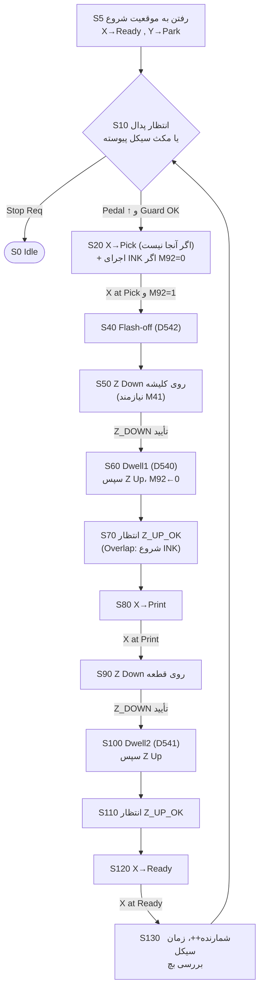

# ۳. ماشین وضعیت (FSM / Step Logic)

## ۳-۱ معماری کلی

برنامه از چند ماشین وضعیت **مستقل** ساخته شده است. هر کدام یک رجیستر مرحله (Step) دارد. «درخواست حرکت» هم از «اجرای حرکت» جداست:

```
            ┌────────────── HMI / پنل ──────────────┐
            │  Mode(M120)  Start  Stop  Home  Jog     │
            └───────┬───────────┬───────────┬────────┘
                    ▼           ▼           ▼
             ┌──────────┐ ┌──────────┐ ┌──────────┐
             │ AUTO  D0 │ │ HOME  D2 │ │ MANUAL   │
             └────┬─────┘ └────┬─────┘ └────┬─────┘
                  │  ┌─────────┴──────┐     │
                  │  │ X-sub D3 Y-sub D4│    │
                  │  └─────────┬──────┘     │
                  │   ┌────────┴─────┐      │
                  └──►│  INK  D1 (Y) │◄─────┘
                      └──────┬───────┘
     درخواست‌ها: M45/M46 (X), M47/M48 (Y), M54/M55 (DZRN), M60/M61 (Z)
                             ▼
   ┌──────────────── MOTION BLOCK (آخر برنامه) ─────────────────┐
   │ اینترلاک:  M40 (X)   M42 (Y)   M41 (Z-Down)   M29 (Stop)     │
   │ یک DDRVA و یک DZRN برای هر کانال  ─► Y0/Y1, Y2/Y3           │
   └─────────────────────────────────────────────────────────────┘
```

**قاعده‌ی طلایی:** برای هر کانال پالس فقط **یک** دستور `DDRVA` و **یک** `DZRN` در کل برنامه وجود دارد. همه‌ی حالت‌ها (اتومات، Jog، Go-To، عقب‌نشینی هوم) فقط مقصد را در `D200` یا `D204` و سرعت را در `D202` یا `D206` می‌نویسند و بیت درخواست را فعال می‌کنند. این کار دو مشکل رایج PLCهای دلتا را حذف می‌کند:

1. تداخل چند دستور پالس روی یک خروجی (فقط اولی اجرا می‌شود و بقیه بی‌صدا نادیده گرفته می‌شوند).
2. اجرا نشدن دوباره‌ی دستور، چون کنتاکت بین دو حرکت حتی یک اسکن هم OFF نشده است. پرچم `M58/M59` («کانال دست‌کم یک اسکن آزاد بوده است») این مشکل را حل می‌کند.

## ۳-۲ حالت‌های کلی ماشین (D9)



## ۳-۳ سکانس هومینگ (D2 و زیرسکانس‌های D3 و D4)

| مرحله | عمل | شرط عبور | خطا |
|---|---|---|---|
| H10 | M60 و M61 Reset، پاک کردن پرچم‌های هوم، پد بالا | `M25` (Z بالا و تأییدشده) | A08 (Timeout صعود Z) |
| H20 | شروع موازی زیرسکانس‌های X و Y | – | – |
| H30 | انتظار | `D3=0` و `D4=0` و `M24` | A11 / A12 |
| H40 | X ← Ready و Y ← Park | `M34` و `M33` | A16 |

**زیرسکانس هر محور (X با D3، Y با D4):**

| مرحله | عمل | توضیح |
|---|---|---|
| 10 | اگر روی سنسور است، موقعیت ← 0 و **عقب‌نشینی ۳۰ mm** با سرعت Creep | DZRN اگر روی DOG شروع شود رفتار نامعین دارد |
| 15 | انتظار پایان عقب‌نشینی | |
| 20 | اگر هنوز روی DOG است: **A11 یا A12 (سنسور گیر کرده)**. وگرنه `DZRN` | سرعت هوم و Creep (دو مرحله‌ای، دقت تکرارپذیری) |
| 25 | پایان DZRN: `D1030 ← 0`، `M22 ← 1` | Timeout کل زیرسکانس با `D547` |

> **ترتیب ایمن:** اول Z بالا، بعد X و Y هم‌زمان. چون پد بالاست، بین کاپ و پد تداخلی نیست. اگر Z بالا نرود، هومینگ شروع نمی‌شود.

## ۳-۴ سیکل اتومات (D0)



**زیرسکانس جوهرزنی (D1):**

| مرحله | عمل | شرط |
|---|---|---|
| 10 | Y ← END با سرعت `D527` | `M42` (Z بالا یا پد بیرون از ناحیه) |
| 20 | Y ← PARK با سرعت `D528` | |
| پایان | `M92 = 1` (تصویر آماده) و `D1 = 0` | |

* **حالت عادی** (`M500=0`): جوهرزنی در S20 و پیش از برداشت انجام می‌شود. این ترتیبی است که خودتان خواسته بودید.
* **حالت Overlap** (`M500=1`): جوهرزنی در S70 شروع می‌شود، یعنی درست بعد از برداشت، و موازی با حرکت X به ایستگاه چاپ. S20 سیکل بعد فقط منتظر `M92` می‌ماند.

### جدول انتقال‌ها و نگهبان‌ها (Guards)

| از | به | شرط | اینترلاک سخت (داخل Motion Block) |
|---|---|---|---|
| S20 | S40 | `M31 ∧ M92` | حرکت X فقط با `M40` (Z بالا) |
| S40 | S50 | `T202` | |
| S50 | S60 | `M62 ∨ DryRun` | `Y4` فقط با `M41 = (M31∧M33) ∨ M32` |
| S60 | S70 | `T200` | – |
| S70 | S80 | `M25` | |
| S80 | S90 | `M32` | `M40` |
| S90 | S100 | `M62 ∨ DryRun` | `M41` |
| S100 | S110 | `T201` | |
| S110 | S120 | `M25` | |
| S120 | S130 | `M34` | `M40` |

**تعریف «رسیدن»:** در این طرح، رسیدن به مقصد با **موقعیت واقعی** داخل پنجره‌ی ±`D548` **و** «پالس در حال ارسال نیست» (`M1336 = 0`) تشخیص داده می‌شود، نه فقط با پرچم `M1029`. دو مزیت دارد:

* اگر محور از قبل در مقصد باشد، فرمان حرکت صفر پالسی صادر نمی‌شود. (دستور DDRVA با صفر پالس ممکن است هیچ‌وقت پرچم پایان ندهد.)
* اگر حرکت نیمه‌کاره قطع شود، سکانس جلو نمی‌رود و Watchdog مرحله (A16) فعال می‌شود.

## ۳-۵ حالت دستی (Manual)

شرط ورود (`M38`): `M120 = 0`، اتومات در حال اجرا نیست، هومینگ و جوهرزنی فعال نیستند، و آلارم نیست.

| فرمان | رفتار | محدودیت |
|---|---|---|
| Jog X+ و X− (M104، M105) | **Hold-to-run**. در لبه‌ی فشار، مقصد = Soft-Limit. با رها کردن، کنتاکت قطع و محور ترمز می‌شود | هوم‌نشده: حداکثر ±۵۰ mm در هر فشار و با سرعت Creep |
| Jog Y+ و Y− (M106، M107) | مثل بالا | |
| Go-To (M110 تا M113) | حرکت با سرعت دستی `D523` یا `D529` | هوم‌شده و مجوزها |
| Y Test Stroke (M117) | اجرای یک رفت و برگشت کامل جوهرزنی | |
| Z Down و Z Up (M108، M109) | Set و Reset کردن `M61` | فقط در Pick (با Y در Park) یا Print. اگر مجوز از دست برود، `M61` خودکار Reset می‌شود |

## ۳-۶ رفتار در آلارم

| کلاس | آلارم‌ها | واکنش |
|---|---|---|
| **A** (از دست رفتن موقعیت) | A01 E-Stop، A02 و A03 درایور، A04 و A05 Over-travel، A10 خروج Z از بالا حین حرکت | توقف **فوری** پالس (`M1078` و `M1104`)، لغو همه‌ی سکانس‌ها، پد بالا، **حذف وضعیت هوم** |
| **A′** | A13 گارد، A14 ارتباط HMI | توقف فوری پالس. وضعیت هوم حفظ می‌شود |
| **B** | A06 هوا، A07 تا A09 مربوط به Z، A11 و A12 هوم، A15 پارامتر، A16 Timeout مرحله | لغو سکانس، رها شدن درخواست‌ها (ترمز با شیب Decel)، پد بالا |

پس از Reset:

* اگر علت آلارم هنوز باقی باشد، در اسکن بعد دوباره فعال می‌شود.
* شروع اتومات از **S5** است، یعنی اول رفتن به موقعیت شروع.
* بعد از آلارم کلاس A، **هومینگ دوباره الزامی است**.
