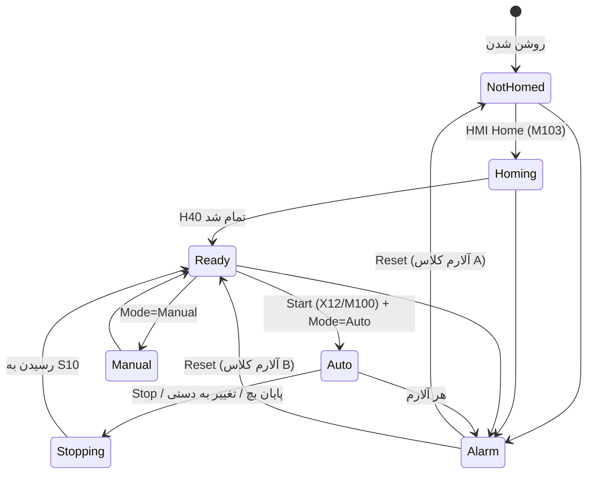
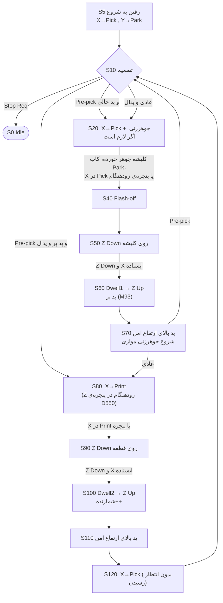

# ۳. ماشین وضعیت (FSM / Step Logic)

## ۳-۱ معماری کلی

برنامه از چند ماشین وضعیت **مستقل** ساخته شده است. هر کدام یک رجیستر مرحله (Step) دارد. «درخواست حرکت» هم از «اجرای حرکت» جداست:

```
            ┌────────────── HMI / پنل ──────────────┐
            │  Mode(M120)  Start  Stop  Home  Jog     │
            └───────┬───────────┬───────────┬────────┘
                    ▼           ▼           ▼
             ┌──────────┐ ┌──────────┐ ┌──────────┐
             │ AUTO  D0 │ │ HOME  D2 │ │ MANUAL   │
             └────┬─────┘ └────┬─────┘ └────┬─────┘
                  │  ┌─────────┴──────┐     │
                  │  │ X-sub D3 Y-sub D4│    │
                  │  └─────────┬──────┘     │
                  │   ┌────────┴─────┐      │
                  └──►│  INK  D1 (Y) │◄─────┘
                      └──────┬───────┘
     درخواست‌ها: M45/M46 (X), M47/M48 (Y), M54/M55 (DZRN), M60/M61 (Z)
                             ▼
   ┌──────────────── MOTION BLOCK (آخر برنامه) ─────────────────┐
   │ اینترلاک:  M40 (X)   M42 (Y)   M41 (Z-Down)   M29 (Stop)     │
   │ یک DDRVA و یک DZRN برای هر کانال  ─► Y0/Y1, Y2/Y3           │
   └─────────────────────────────────────────────────────────────┘
```

**قاعده‌ی طلایی:** برای هر کانال پالس فقط **یک** دستور `DDRVA` و **یک** `DZRN` در کل برنامه وجود دارد. همه‌ی حالت‌ها (اتومات، Jog، Go-To، عقب‌نشینی هوم) فقط مقصد را در `D200` یا `D204` و سرعت را در `D202` یا `D206` می‌نویسند و بیت درخواست را فعال می‌کنند. این کار دو مشکل رایج PLCهای دلتا را حذف می‌کند:

1. تداخل چند دستور پالس روی یک خروجی (فقط اولی اجرا می‌شود و بقیه بی‌صدا نادیده گرفته می‌شوند).
2. اجرا نشدن دوباره‌ی دستور، چون کنتاکت بین دو حرکت حتی یک اسکن هم OFF نشده است. پرچم `M58/M59` («کانال دست‌کم یک اسکن آزاد بوده است») این مشکل را حل می‌کند.

## ۳-۲ حالت‌های کلی ماشین (D9)


```mermaid
stateDiagram-v2
    [*] --> NotHomed : روشن شدن
    NotHomed --> Homing : HMI Home (M103)
    Homing --> Ready : H40 تمام شد
    Ready --> Auto : Start (X12/M100) + Mode=Auto
    Auto --> Stopping : Stop / پایان بچ / تغییر به دستی
    Stopping --> Ready : رسیدن به S10
    Ready --> Manual : Mode=Manual
    Manual --> Ready
    NotHomed --> Alarm
    Homing --> Alarm
    Ready --> Alarm
    Auto --> Alarm : هر آلارم
    Alarm --> NotHomed : Reset (آلارم کلاس A)
    Alarm --> Ready : Reset (آلارم کلاس B)
```

## ۳-۳ سکانس هومینگ (D2 و زیرسکانس‌های D3 و D4)

| مرحله | عمل | شرط عبور | خطا |
|---|---|---|---|
| H10 | M60 و M61 Reset، پاک کردن پرچم‌های هوم، پد بالا | `M25` (Z بالا و تأییدشده) | A08 (Timeout صعود Z) |
| H20 | شروع موازی زیرسکانس‌های X و Y | – | – |
| H30 | انتظار | `D3=0` و `D4=0` و `M24` | A11 / A12 |
| H40 | X ← Park و Y ← Park | `M34` و `M33` | A16 |

**زیرسکانس هر محور (X با D3، Y با D4):**

| مرحله | عمل | توضیح |
|---|---|---|
| 10 | اگر روی سنسور است، موقعیت ← 0 و **عقب‌نشینی ۳۰ mm** با سرعت Creep | DZRN اگر روی DOG شروع شود رفتار نامعین دارد |
| 15 | انتظار پایان عقب‌نشینی | |
| 20 | اگر هنوز روی DOG است: **A11 یا A12 (سنسور گیر کرده)**. وگرنه `DZRN` | سرعت هوم و Creep (دو مرحله‌ای، دقت تکرارپذیری) |
| 25 | پایان DZRN: `D1030 ← 0`، `M22 ← 1` | Timeout کل زیرسکانس با `D547` |

> **ترتیب ایمن:** اول Z بالا، بعد X و Y هم‌زمان. چون پد بالاست، بین کاپ و پد تداخلی نیست. اگر Z بالا نرود، هومینگ شروع نمی‌شود.

## ۳-۴ سیکل اتومات (D0) — نسخه‌ی ۲


```mermaid
flowchart TD
    S5["S5  رفتن به شروع<br/>X→Pick , Y→Park"] --> S10
    S10{"S10  تصمیم"} -->|Stop Req| IDLE([S0 Idle])
    S10 -->|"Pre-pick و پد خالی"| S20
    S10 -->|"Pre-pick و پد پر و پدال"| S80
    S10 -->|"عادی و پدال"| S20
    S20["S20  X→Pick + جوهرزنی اگر لازم است"] -->|"کلیشه جوهر خورده، کاپ Park،<br/>X در Pick یا پنجره‌ی زودهنگام"| S40
    S40["S40  Flash-off"] --> S50
    S50["S50  Z Down روی کلیشه"] -->|"Z Down و X ایستاده"| S60
    S60["S60  Dwell1 → Z Up<br/>پد پر (M93)"] --> S70
    S70["S70  پد بالای ارتفاع امن<br/>شروع جوهرزنی موازی"] -->|Pre-pick| S10
    S70 -->|عادی| S80
    S80["S80  X→Print<br/>(Z زودهنگام در پنجره‌ی D550)"] -->|"X در Print یا پنجره"| S90
    S90["S90  Z Down روی قطعه"] -->|"Z Down و X ایستاده"| S100
    S100["S100  Dwell2 → Z Up<br/>شمارنده++"] --> S110
    S110["S110  پد بالای ارتفاع امن"] --> S120
    S120["S120  X→Pick (بدون انتظار رسیدن)"] --> S10
```

### سه قابلیت جدید

| قابلیت | گزینه | چه می‌کند |
|---|---|---|
| **جوهرزنی موازی** | `M500` (پیش‌فرض روشن) | بعد از برداشت، به‌محض اینکه پد از ارتفاع امن بالاتر رفت، کاپ جوهرزنی بعدی را شروع می‌کند. هم‌زمان X به سمت قطعه می‌رود |
| **هم‌پوشانی حرکت** | `M507` + `D550` | ① X بعد از عبور پد از **ارتفاع امن** راه می‌افتد و منتظر رسیدن پد به بالا نمی‌ماند. ② Z وقتی X به فاصله‌ی `D550` از مقصد رسید پایین آمدن را شروع می‌کند |
| **برداشت زودتر** | `M506` + `D552` | بعد از هر چاپ، پد فوراً از کلیشه رنگ برمی‌دارد و بالای کلیشه منتظر پدال می‌ماند. بعد از پدال فقط «X→چاپ و فرود» انجام می‌شود. اگر انتظار بیشتر از `D552` شود، رنگ خشک فرض می‌شود و پد دوباره برمی‌دارد |

### قانون طلایی هم‌پوشانی

> **وقتی پد روی سطح است، X باید ساکن باشد.**

| لایه | پیاده‌سازی |
|---|---|
| ۱. زمان‌بندی | `D550` طوری تنظیم می‌شود که X بایستد پیش از آنکه پد از ارتفاع امن پایین‌تر برود |
| ۲. توقف در ارتفاع امن | اگر X هنوز حرکت دارد و پد از **ارتفاع امن** پایین‌تر رفت ⇒ **A10**، توقف فوری |
| ۳. فرود حین حرکت | اگر سنسور Down روشن شد و X هنوز حرکت دارد ⇒ **A17**، توقف فوری |
| ۴. شروع Dwell | Dwell فقط وقتی شروع می‌شود که **پد پایین و X ایستاده** باشد (S50 و S90) |

**روش تنظیم `D550`:** با `M507 = 0` شروع کنید. بعد `M507 = 1` و `D550 = 5 mm` بگذارید و مرحله‌به‌مرحله ۵ mm اضافه کنید. هر بار چاپ را از نظر سایه و کشیدگی چک کنید. اولین باری که A10 آمد یا چاپ کشیده شد، **۲۰٪ عقب** بکشید.

### پدال

پدال در مرحله‌های S5 تا S70 **ذخیره** می‌شود (`M94`). اگر اپراتور وسط برداشت پدال بزند، چاپ بلافاصله بعد از برداشت انجام می‌شود. در مرحله‌های چاپ (S80 به بعد) پدال نادیده گرفته می‌شود.

**زیرسکانس جوهرزنی (D1):** Y ← END با `D527`، سپس Y ← PARK با `D528`، و در پایان `M92 = 1`. شرط حرکت: `M42`، یعنی پد بالای ارتفاع امن باشد یا X بیرون از ناحیه‌ی کلیشه.

### جدول انتقال‌ها

| از | به | شرط | اینترلاک سخت |
|---|---|---|---|
| S20 | S40 | `M92 ∧ M33 ∧ (M31 ∨ M63)` | حرکت X فقط با `M40` (پد بالای ارتفاع امن) |
| S50 | S60 | `(M62 ∨ DryRun) ∧ M31` | `Y4` فقط با `M41` |
| S60 | S70 | `T200` | – |
| S70 | S10 / S80 | `M26` | |
| S80 | S90 | `M32 ∨ M64` | `M40` |
| S90 | S100 | `(M62 ∨ DryRun) ∧ M32` | `M41` شامل پرده‌ی نوری |
| S100 | S110 | `T201` | |
| S110 | S120 | `M26` | |
| S120 | S10 | فرمان حرکت صادر شد، یا X از قبل در Pick است | `M40` |

**تعریف «رسیدن»:** موقعیت واقعی داخل ±`D548` **و** `M1336 = 0`. اگر محور از قبل در مقصد باشد، فرمان حرکت صادر نمی‌شود. اگر حرکت نیمه‌کاره قطع شود، Watchdog مرحله (A16) فعال می‌شود.

## ۳-۵ حالت دستی (Manual)

شرط ورود (`M38`): `M120 = 0`، اتومات در حال اجرا نیست، هومینگ و جوهرزنی فعال نیستند، و آلارم نیست.

| فرمان | رفتار | محدودیت |
|---|---|---|
| Jog X+ و X− (M104، M105) | **Hold-to-run**. در لبه‌ی فشار، مقصد = Soft-Limit. با رها کردن، کنتاکت قطع و محور ترمز می‌شود | هوم‌نشده: حداکثر ±۵۰ mm در هر فشار و با سرعت Creep |
| Jog Y+ و Y− (M106، M107) | مثل بالا | |
| Go-To (M110 تا M113) | حرکت با سرعت دستی `D523` یا `D529` | هوم‌شده و مجوزها |
| Y Test Stroke (M117) | اجرای یک رفت و برگشت کامل جوهرزنی | |
| Z Down و Z Up (M108، M109) | Set و Reset کردن `M61` | فقط با X **ایستاده** در Pick (با Y در Park) یا Print. اگر مجوز از دست برود، `M61` خودکار Reset می‌شود |

## ۳-۶ رفتار در آلارم

| کلاس | آلارم‌ها | واکنش |
|---|---|---|
| **A** (از دست رفتن موقعیت) | A01 E-Stop، A02 و A03 درایور، A04 و A05 Over-travel، A10 پد زیر ارتفاع امن حین حرکت، A17 فرود حین حرکت X | توقف **فوری** پالس (`M1078` و `M1104`)، لغو همه‌ی سکانس‌ها، پد بالا، **حذف وضعیت هوم** |
| **A′** | A13 گارد، A14 ارتباط HMI | توقف فوری پالس. وضعیت هوم حفظ می‌شود |
| **B** | A06 هوا، A07 تا A09 مربوط به Z، A11 و A12 هوم، A15 پارامتر، A16 Timeout مرحله | لغو سکانس، رها شدن درخواست‌ها (ترمز با شیب Decel)، پد بالا |

پس از Reset:

* اگر علت آلارم هنوز باقی باشد، در اسکن بعد دوباره فعال می‌شود.
* شروع اتومات از **S5** است، یعنی اول رفتن به موقعیت شروع.
* بعد از آلارم کلاس A، **هومینگ دوباره الزامی است**.
